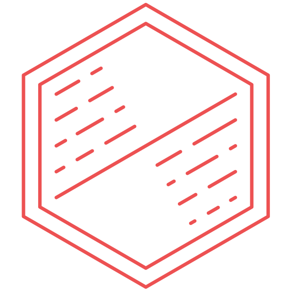

<p align="center">
  <a href="https://shyft.dev" target="_blank">
    
  </a>
</p>
<br />

# Shyft

Shyft is a server-side framework for building powerful GraphQL APIs.

## Install

With yarn:

```
yarn add shyft
```

or using npm:

```
npm install -S shyft
```

GraphQL is a peer dependency. Install it with:

```
yarn add graphql
```

## Tests

Run once:

```
yarn run test
```

Run in watch mode:

```
yarn run test-watch
```
